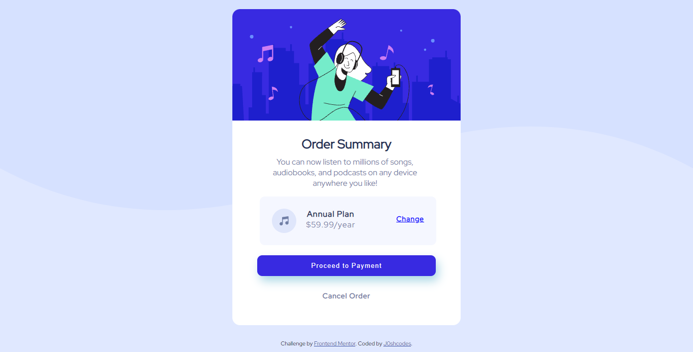

# Frontend Mentor - Order summary card solution

This is a solution to the [Order summary card challenge on Frontend Mentor](https://www.frontendmentor.io/challenges/order-summary-component-QlPmajDUj). Frontend Mentor challenges help you improve your coding skills by building realistic projects. 

## Table of contents

- [Overview](#overview)
  - [The challenge](#the-challenge)
  - [Screenshot](#screenshot)
  - [Links](#links)
- [My process](#my-process)
  - [Built with](#built-with)
  - [What I learned](#what-i-learned)
  - [Useful resources](#useful-resources)
- [Author](#author)

## Overview

### The challenge

Users should be able to:

- See hover states for interactive elements

### Screenshot




### Links

- Solution URL: [The Solution](https://github.com/J0shcodes/order-summary)
- Live Site URL: [The live site](https://j0shcodes.github.io/order-summary/)

## My process
Started off first with the HTML markup and then moved over to the CSS file while making changes to the HTML file on the fly.

### Built with

- Semantic HTML5 markup
- CSS custom properties
- Flexbox
- Mobile-first workflow

### What I learned

I learnt surprising that I could use the background-image property as well as the background-color property on an element as long as the background image doesn't cover the entire background of the element, and that was what I used to create the wavy background as the main background for the web page.   

To see how you can add code snippets, see below:

codes I am proud of:

```html
<div class="plan">
          <div class="music">
              
              <div class="price">
                <p class="duration">Annual Plan</p>
                <p class="amount">$59.99/year</p>
              </div>
            </span>
          </div>
          <div class="change_plan">
            <a href="" class="change">Change</a>
          </div>
        </div>
```
```css
body {
  font-family: 'Red Hat Display';
  background-image: url('images/pattern-background-desktop.svg');
  background-repeat: no-repeat;
  background-size: contain;
  background-color: hsl(225, 100%, 94%);
}
```

### Useful resources

- [CSS box-shadow](https://www.w3schools.com/cssref/css3_pr_box-shadow.asp) - This helped me when trying to style the box-shadow for the button.


## Author

- Website - [Joshua](https://github.com/J0shcodes)
- Frontend Mentor - [J0shcodes](https://www.frontendmentor.io/profile/J0shcodes)
- Twitter - [Jphleg](https://www.twitter.com/Jphleg)

